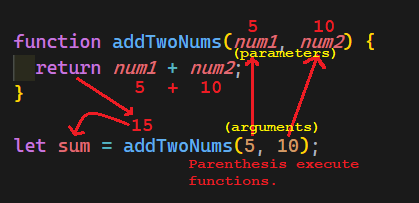

# Function Intro

- A function is a way to re-use code so that you don't have to copy paste the same code when you need it to run again, instead, you put that code into a function and execute the function when you want the code to run again.
- A function may need to be given some information in order to do it's job, just like you may need information to perform a task.

## 

## Example

- Let's make a simple function to check if someone has enough money to make a purchase.

### Analogy

- Your friend calls you and asks: "Can I afford to buy this thing?"
  - What would you ask your friend in order to answer their question in the simplest way?
    - How much does it cost?
    - How much money do you have?
  - These are the exact pieces of information (**parameters**) that your function would also need to know in order to answer the question / solve the problem.
  - The question is a yes or no question, so the answer is a "yes" or "no". In programming terms, the function would `return` to us an answer / helpful information, in this case the `return` value would be a `true` or a `false`.

### Solution

- ```js
  /**
   * Determines if there is enough budget to make a purchase.
   * @param {number} cost This is the first parameter. It is the cost of the
   *    desired item to be purchased.
   * @param {number} budget This is the second parameter name. It is the
   *    available budget to spend.
   * @returns {bool} The data type of that this function returns is a
   *    boolean (true or false) representing if there is enough budget to make
   *    the purchase.
   */
  function canAffordToBuy(cost, budget) {
    if (cost <= budget) {
      return true;
    } else {
      return false;
    }
  }
  ```

- ```js
  canAffordToBuy(10, 20);
  ```

  - argument1 is `10`, the value of the `cost` parameter will be `10`
  - argument2 is `20`, the value of the `budget` parameter will be `20`

### Store the returned value

- ```js
  var canAffordCar = canAffordToBuy(20000, 15000);
  ```

  1. `canAffordToBuy(20000, 15000);` returns `false` as a piece of data.
  2. The variable `canAffordCar` has `false` assigned into it so we can refer back to it without having to execute the function again.

## Example Extended

- What if we wanted to make it more flexible and know if someone has enough money to buy multiple items?
- Our function now needs more information, the cost of multiple items

### Solution With Extended Requirements

- Change `cost` parameter to `costs` to indicate it will be an array where each item is a cost
- Sum the `costs` to get a `totalCost`

- ```js
  function canAffordToBuy(costs, budget) {
    var totalCost = 0;

    for (let i = 0; i < costs.length; i++) {
      totalCost += costs[i];
    }

    if (totalCost <= budget) {
      return true;
    } else {
      return false;
    }
  }
  ```
