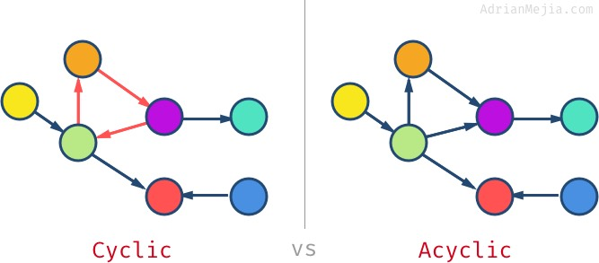
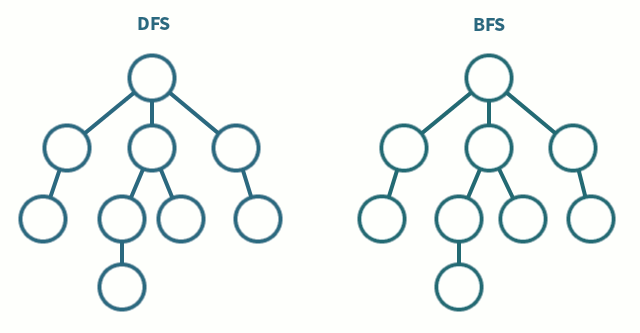
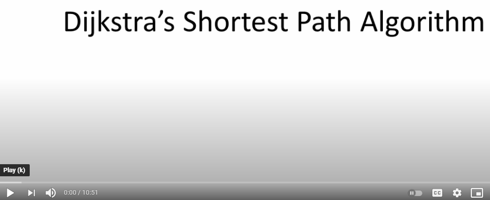

# [Graph](./index.js)

- A non-linear data structures that contains nodes and edges.
- A node (vertex / point) is a single unique value.
- An edge represents a connection / relationship between two nodes (a pointer).

---

## Uses

- Driving directions (GPS).
  - Node / vertex = road intersection.
  - Edge = road.
  - Weight = time and/or distance between intersections.
- Airline routes
  - Node / vertex = airport.
  - Edge / neighbor = destination.
  - Weight = time and/or distance between airports.
- Flight reservations.
- Network routing.
  - Node / vertex = server.
  - Edge = data link.
  - Weight = connection speed.
- Electronic circuits.
- Graphs help to plan the logistics of delivering goods.
- Telcom: Cell tower frequency planning.
- Social networks. E.g., Facebook uses a graph for suggesting friends.
- Recommendations: Amazon/Netflix uses graphs to make suggestions for products/movies.

---

## Types of Graphs

### Directed Graph (Nodes Connected In A Certain Direction)

- For one-way streets.
- On instagram, every user is a node, every follow creates a new edge connecting two nodes together.
- This is a directed graph because when you follow someone it doesn't mean they automatically follow you back.

#### Cyclic vs Acyclic

### Undirected Graph

- For two-way streets.
- On facebook, a friendship goes both ways.
- Also used in recommendation algorithms such as connecting recommended netflix movies to the ones you've watched.
- Used to represent geographic data - on google maps you can think of every intersection as a node and every road and it's distance as the edge connecting those nodes.

### Weighted Graph

- Nodes have additional data about the relationship, like the distance between two airport nodes or a cost or some other value. If the weight is absent, we can assume it's 1.
- A node could also point to itself (cycle). This could represent an airplane that takes off from and comes back to land at the same airport.

### Disconnected VS Connected VS Complete

- Connected graph: all nodes have at least one edge.
- Complete graph: all nodes connected to all other nodes. This requires that each node should have (total #nodes - 1) edges. In the example image there are seven vertices, so each node has 6 edges.

---

## Representing a Graph in Code

### Adjacency Matrix (2d Array)

- One row and one column are created for every node.
- When two nodes have an edge / connection, add a `1` where they intersect.
- Easy to add or lookup a specific edge.
- This requires quadratic O(n^2) space for overall storage and quadratic time to insert a new node into the graph.

### Adjacency List

- `.has` equal or better Big O Time Complexity.
- Start with a _collection_ (JS `Map` object) of nodes.
- Each node has it's own list of it's neighbors / adjacents (edges / connections).
- This makes it faster to iterate over a nodes edges and is more memory efficient, especially with many nodes and few edges.

---

## Traversing a Graph

"BFS can be used to find the shortest path, with unit weight edges, from a node (original source) to another. Whereas, DFS can be used to exhaust all the choices because of its nature of going in depth, like discovering the longest path between two nodes in an acyclic graph."

- Depth and Breadth First Search can be used to find a path between two nodes and return early when the destination node is found.

### Depth First Search (DFS - Recursive)

1. Start with any node.
2. Visit first child.
3. While there is a first child, keep traversing to it.
4. Once you've gone all the way down, backtrack to previous node and go to the 2nd child repeatedly.

### Breadth First Search (BFS)

1. From starting node, add all of it's children to a queue.
2. Visit each node in the queue.
3. While visiting each node in the queue, add all of it's children to the queue.

---

## Big O Notation

---

### Terms

- Node: Vertex / Point, Neighbor / Edge.
- Edge: connection between two nodes.

O(V + E) means Vertices + Edges and can also be written as O(n) since it's
linear. However, since a node can be both a vertex and multiple edges since it
can be connected to many nodes, the same node can be visited multiple times.
Even though we have logic to avoid re-processing an already visited node, the
soonest we can stop re-processing it is as soon as we see it again and realize
we are re-visiting it.

## Videos

