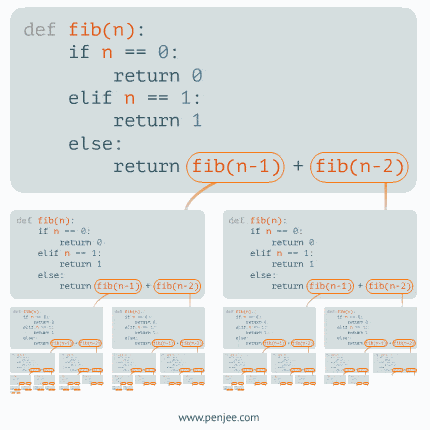

# Recursion Intro

- [Recursion Visualized](https://visualgo.net/bn/recursion)

---

## Base Case

- The goal of the recursion where you return a value instead of more recursive function calls.
- `return functionName()`
  - Typically when doing recursion, you need to `return` the recursive function call, otherwise, the base case is only returned within nested function calls and does not get returned all the way out to the first call to the function.

---

## Termination Condition

- When something 'bad' happens, exit the recursion with `return`.
- Prevents bad inputs from triggering the recursion.

---

## Call Stack

- When a function is called from within another function, the inner function must finish before the outer function can finish, which is a Last In First Out (LIFO) ordering pattern.
- LIFO is implemented using what is called a stack. Imagine a stack of heavy blocks, it is easier to add to the top and remove from the top than trying to remove from anywhere else because it would be much heavier. Adding to the top and removing from the top is LIFO.
- A stack is implemented using an array or a linked list, with an array, the "top" of the stack is at the back of the array, so `.push` and `.pop` are used for LIFO. With a linked list the "top" of the stack is at the front, so `insertAtFront` and `removeHead` are used for LIFO. A linked list uses the front so that `O(1)` constant time complexity can be achieved for both add and remove operations just like `.push` and `.pop` are `O(1)` constant time, meaning no iteration is required for these operations to do their job.
- In a call stack, it is a stack of the pending functions that have been started but have not been finished yet, the last function to be called will be the first function to finish and then removed from the call stack (LIFO) when the function's `return` happens.

### Simple Non-recursive call stack example

```js
/* 
This demonstrates how the call stack works without recursion. The call stack is
used when any function executes another function because the outer function
has to wait for the nested function to be done before the outer function can
complete. The call stack is used to go back and resume execution of the outer
function when the nested function is finishes.
*/

function first(n) {
  console.log(
    `ƒ'first'  is being executed and has been pushed into the call stack.`
  );
  // Before 'first' can finish, it needs to wait for second() to finish.
  const secondResult = second(n + 1);
  console.log(
    `ƒ'second' returned the value: ${secondResult}.   ƒ'second' was popped out of the call stack.`
  );
  /* 
  return signals the function is done and can be removed from the stack so the
  next function in the stack can be resumed if there was a function waiting for
  the current function to finish. Functions without a return will return
  undefined at the end.
  */
  return "one";
}

function second(n) {
  console.log(
    `ƒ'second' is being executed and has been pushed into the call stack.`
  );
  // Before 'second' can finish, it needs to wait for third() to finish.
  const thirdResult = third(n + 1);
  console.log(
    `ƒ'third'  returned the value: ${thirdResult}. ƒ'third' was popped out of the call stack.`
  );
  return "two";
}

function third(n) {
  console.log(
    `ƒ'third'  is being executed and has been pushed into the call stack.`
  );
  return "three";
}

const firstResult = first(1);
console.log(
  `ƒ'first'  returned the value: ${firstResult}.   ƒ'first' was popped out of the call stack.`
);

/* 
The above logs print in the order shown below. Notice the order of execution is
one -> two -> three, but the order of returning is
three -> two -> one because the first function can't finish until the second
function finishes and the second function can't finish until the third function
finishes.

ƒ'first'  is being executed and has been pushed into the call stack.
ƒ'second' is being executed and has been pushed into the call stack.
ƒ'third'  is being executed and has been pushed into the call stack.
ƒ'third'  returned the value: three. ƒ'third' was popped out of the call stack.
ƒ'second' returned the value: two.   ƒ'second' was popped out of the call stack.
ƒ'first'  returned the value: one.   ƒ'first' was popped out of the call stack.
*/
```

The below picture shows the call stack of the above code in debug mode. Adding breakpoints to the top and to the return line(s) of your functions can be very helpful to watch how the call stack is filled up (`push`) and follow the changing parameter values and local vars, and to see the call stack 'unwind' (`pop`).


- Recursion works in the same way as above except the function keeps calling itself instead of a different function.




---

## Space Complexity

If you have two functions that simply loop through an array and print the values but one uses a `for` or `while` loop and the other uses recursion and none of the functions copy the array elements into another data structure, the recursive function will take up more space because recursion requires adding pending function calls onto the call stack.

The space complexity is therefore calculated by the maximum depth of the call stack which is often `O(n)` where `n` is the size of the input whether it's an array or a number that determines how much recursion happens, such as in the case of recursive factorial where the passed in number is recursively multiplied to one number less than itself until you get down to 0.

If the recursive function also creates a data structure that takes up `n` space each recursive call, that additional space taken up needs to be multiplied to the call stack `m` space to calculate the total space complexity: `O(n) * O(m)` -> `O(n * m)` -> `O(nm)`.

Because of this, iterative (non-recursive) solutions have a space complexity advantage.

---

## Pass By Value / Reference

- Primitive data types are passed into functions by value, or as a "copy"
  - i.e., if you pass a string that is in a var to 3 separate functions, each function gets it's own copy of the string, if the string is changed in one of the 3 functions, it is only being changed in that one place
  - In some cases with recursion, using a primitive value parameter that you update in recursive function calls will cause a problem since the parameter exists as a copy in multiple recursive calls and therefore can be updated separately from one another and become out of sync.
    - One solution to this is to save your recursively returned value into a variable before proceeding: `const result = myRecursiveFunction();`
    - Another solution to this is to put the primitive value parameter into an object or array and then use that as the parameter so that it is passed to functions via reference so that all recursive functions refer to the same single object, so if it is updated, all pointers have that up-to-date data by reference.
